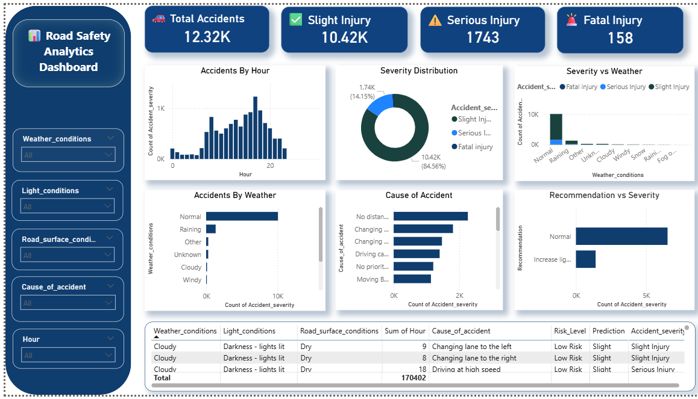

# 🚗 Road Safety Analytics & Accident Severity Prediction System

## 📌 Project Overview

This project is an end-to-end **Road Safety Analytics and Accident Severity Prediction System** developed using **Machine Learning, Streamlit, and Power BI**.

The main objective of this project is to:
- Analyze accident patterns
- Predict accident severity
- Identify major risk factors
- Provide safety recommendations
- Visualize accident insights through interactive dashboards

This project combines:
- Data Cleaning
- Exploratory Data Analysis (EDA)
- Machine Learning
- Interactive Dashboard Development
- Business Intelligence Visualization

---

# 🎯 Problem Statement

Road accidents are increasing due to:
- Poor weather conditions
- Overspeeding
- Unsafe road conditions
- Low visibility
- Driver behavior

Traditional reports only provide statistics, but this project focuses on:
- Predicting accident severity
- Understanding accident causes
- Providing actionable recommendations
- Supporting data-driven safety analysis

---

# 🚀 Key Features

## ✅ Machine Learning Prediction
- Predicts accident severity:
  - Slight Injury
  - Serious Injury
  - Fatal Injury

## ✅ Interactive Streamlit Dashboard
- Real-time prediction interface
- Dynamic charts and KPIs
- User input controls
- Prediction history
- Risk analysis

## ✅ Power BI Dashboard
- Professional analytics dashboard
- Interactive slicers and filters
- KPI cards
- Severity analysis
- Weather impact analysis
- Recommendation insights

## ✅ Recommendation System
Provides safety suggestions based on accident conditions.

Example recommendations:
- Increase lighting & patrol
- Reduce speed
- Drive slowly during rain/fog
- High-risk warning alerts

## ✅ Data Processing
- Missing value handling
- Feature engineering
- Hour extraction
- Data preprocessing
- One-hot encoding

---

# 🛠️ Technologies Used

| Technology | Purpose |
|---|---|
| Python | Core Programming |
| Pandas | Data Processing |
| NumPy | Numerical Operations |
| Scikit-learn | Machine Learning |
| Streamlit | Web Dashboard |
| Power BI | Business Intelligence Dashboard |
| Matplotlib | Data Visualization |
| Joblib | Model Saving/Loading |

---
Note: A sample dataset is included in this repository for demonstration purposes.
# 📊 Machine Learning Workflow

## 1️⃣ Data Cleaning
- Removed null values
- Standardized categorical values
- Processed accident records

## 2️⃣ Feature Engineering
Created features such as:
- Hour
- Weather conditions
- Light conditions
- Road surface conditions
- Cause of accident

## 3️⃣ Encoding
Used One-Hot Encoding for categorical variables.

## 4️⃣ Model Training
Trained classification model for accident severity prediction.

## 5️⃣ Prediction Output
The model predicts:
- Slight Injury
- Serious Injury
- Fatal Injury

---

# 📈 Power BI Dashboard Features

## 🔹 KPI Cards
- Total Accidents
- Slight Injury Cases
- Serious Injury Cases
- Fatal Injury Cases

## 🔹 Interactive Charts
- Accidents by Hour
- Severity Distribution
- Severity vs Weather
- Accidents by Weather
- Cause of Accident
- Recommendation vs Severity

## 🔹 Filters / Slicers
- Weather Conditions
- Light Conditions
- Road Surface Conditions
- Cause of Accident
- Hour

## 🔹 Detailed Analysis Table
Displays:
- Weather
- Light condition
- Road condition
- Cause
- Prediction
- Risk level
- Severity

---

# 🧠 Business Impact

This project can help:
- Traffic departments
- Road safety authorities
- Insurance companies
- Smart city analytics systems

by identifying:
- High-risk conditions
- Accident patterns
- Preventive actions
- Severity trends

---

# 📷 Dashboard Preview

## Power BI Dashboard


---

# 📂 Project Structure

```bash
Road-Safety-Analytics/
│
├── cleaned_data.csv
├── accident_model.pkl
├── model_columns.pkl
├── streamlit_app.py
├── dashboard.pbix
├── requirements.txt
├── README.md
│
└── screenshots/
    └── dashboard.png
